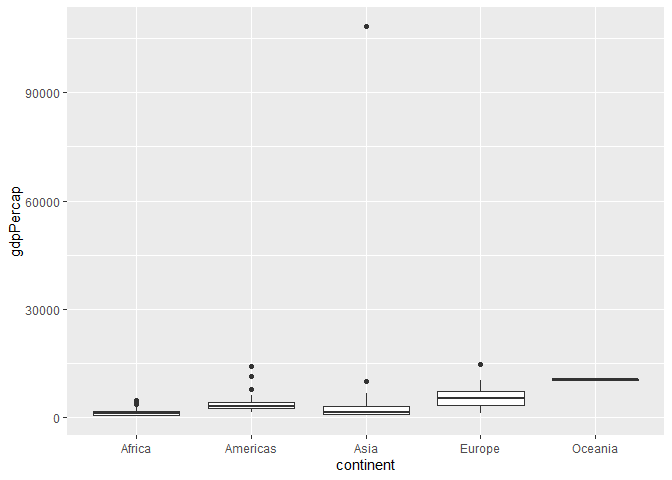
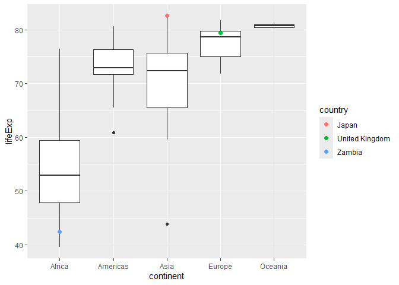
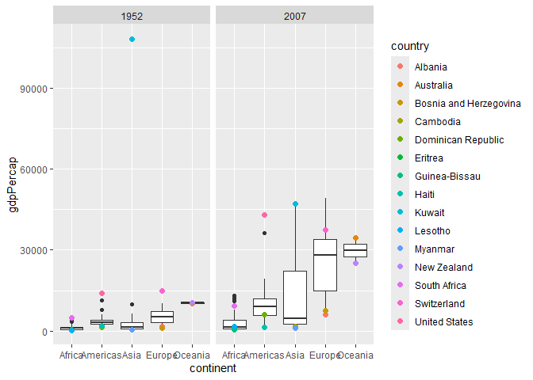
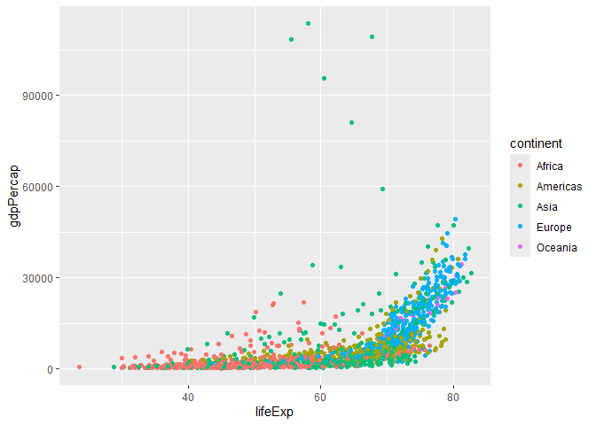
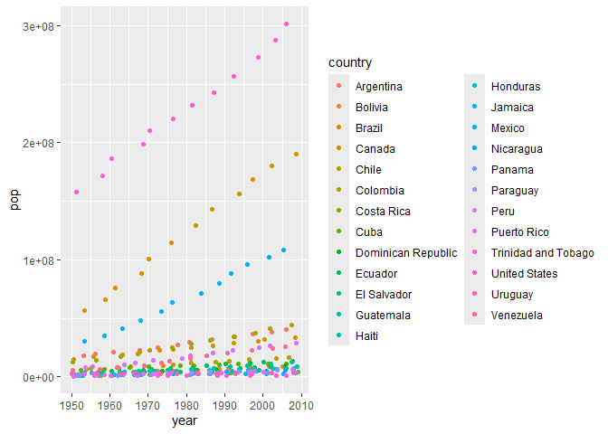
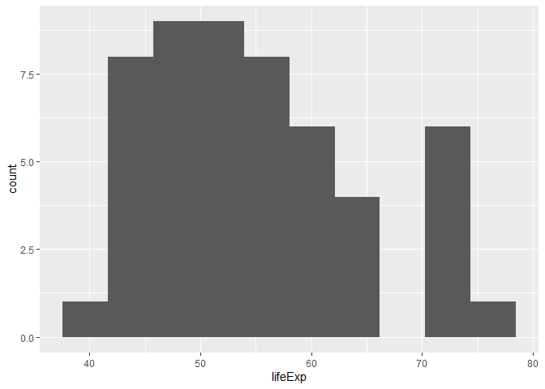

Gapminder
================
Arianne Fong
2026-10-01

- [Grading Rubric](#grading-rubric)
  - [Individual](#individual)
  - [Submission](#submission)
- [Guided EDA](#guided-eda)
  - [**q0** Perform your “first checks” on the dataset. What variables
    are in
    this](#q0-perform-your-first-checks-on-the-dataset-what-variables-are-in-this)
  - [**q1** Determine the most and least recent years in the `gapminder`
    dataset.](#q1-determine-the-most-and-least-recent-years-in-the-gapminder-dataset)
  - [**q2** Filter on years matching `year_min`, and make a plot of the
    GDP per capita against continent. Choose an appropriate `geom_` to
    visualize the data. What observations can you
    make?](#q2-filter-on-years-matching-year_min-and-make-a-plot-of-the-gdp-per-capita-against-continent-choose-an-appropriate-geom_-to-visualize-the-data-what-observations-can-you-make)
  - [**q3** You should have found *at least* three outliers in q2 (but
    possibly many more!). Identify those outliers (figure out which
    countries they
    are).](#q3-you-should-have-found-at-least-three-outliers-in-q2-but-possibly-many-more-identify-those-outliers-figure-out-which-countries-they-are)
  - [**q4** Create a plot similar to yours from q2 studying both
    `year_min` and `year_max`. Find a way to highlight the outliers from
    q3 on your plot *in a way that lets you identify which country is
    which*. Compare the patterns between `year_min` and
    `year_max`.](#q4-create-a-plot-similar-to-yours-from-q2-studying-both-year_min-and-year_max-find-a-way-to-highlight-the-outliers-from-q3-on-your-plot-in-a-way-that-lets-you-identify-which-country-is-which-compare-the-patterns-between-year_min-and-year_max)
- [Your Own EDA](#your-own-eda)
  - [**q5** Create *at least* three new figures below. With each figure,
    try to pose new questions about the
    data.](#q5-create-at-least-three-new-figures-below-with-each-figure-try-to-pose-new-questions-about-the-data)

*Purpose*: Learning to do EDA well takes practice! In this challenge
you’ll further practice EDA by first completing a guided exploration,
then by conducting your own investigation. This challenge will also give
you a chance to use the wide variety of visual tools we’ve been
learning.

<!-- include-rubric -->

# Grading Rubric

<!-- -------------------------------------------------- -->

Unlike exercises, **challenges will be graded**. The following rubrics
define how you will be graded, both on an individual and team basis.

## Individual

<!-- ------------------------- -->

| Category | Needs Improvement | Satisfactory |
|----|----|----|
| Effort | Some task **q**’s left unattempted | All task **q**’s attempted |
| Observed | Did not document observations, or observations incorrect | Documented correct observations based on analysis |
| Supported | Some observations not clearly supported by analysis | All observations clearly supported by analysis (table, graph, etc.) |
| Assessed | Observations include claims not supported by the data, or reflect a level of certainty not warranted by the data | Observations are appropriately qualified by the quality & relevance of the data and (in)conclusiveness of the support |
| Specified | Uses the phrase “more data are necessary” without clarification | Any statement that “more data are necessary” specifies which *specific* data are needed to answer what *specific* question |
| Code Styled | Violations of the [style guide](https://style.tidyverse.org/) hinder readability | Code sufficiently close to the [style guide](https://style.tidyverse.org/) |

## Submission

<!-- ------------------------- -->

Make sure to commit both the challenge report (`report.md` file) and
supporting files (`report_files/` folder) when you are done! Then submit
a link to Canvas. **Your Challenge submission is not complete without
all files uploaded to GitHub.**

``` r
library(tidyverse)
```

    ## Warning: package 'tidyverse' was built under R version 4.4.3

    ## Warning: package 'ggplot2' was built under R version 4.4.3

    ## ── Attaching core tidyverse packages ──────────────────────── tidyverse 2.0.0 ──
    ## ✔ dplyr     1.1.4     ✔ readr     2.1.5
    ## ✔ forcats   1.0.0     ✔ stringr   1.5.1
    ## ✔ ggplot2   4.0.0     ✔ tibble    3.2.1
    ## ✔ lubridate 1.9.4     ✔ tidyr     1.3.1
    ## ✔ purrr     1.0.2     
    ## ── Conflicts ────────────────────────────────────────── tidyverse_conflicts() ──
    ## ✖ dplyr::filter() masks stats::filter()
    ## ✖ dplyr::lag()    masks stats::lag()
    ## ℹ Use the conflicted package (<http://conflicted.r-lib.org/>) to force all conflicts to become errors

``` r
library(gapminder)
```

    ## Warning: package 'gapminder' was built under R version 4.4.3

*Background*: [Gapminder](https://www.gapminder.org/about-gapminder/) is
an independent organization that seeks to educate people about the state
of the world. They seek to counteract the worldview constructed by a
hype-driven media cycle, and promote a “fact-based worldview” by
focusing on data. The dataset we’ll study in this challenge is from
Gapminder.

# Guided EDA

<!-- -------------------------------------------------- -->

First, we’ll go through a round of *guided EDA*. Try to pay attention to
the high-level process we’re going through—after this guided round
you’ll be responsible for doing another cycle of EDA on your own!

### **q0** Perform your “first checks” on the dataset. What variables are in this

dataset?

``` r
## TASK: Do your "first checks" here!
glimpse(gapminder)
```

    ## Rows: 1,704
    ## Columns: 6
    ## $ country   <fct> "Afghanistan", "Afghanistan", "Afghanistan", "Afghanistan", …
    ## $ continent <fct> Asia, Asia, Asia, Asia, Asia, Asia, Asia, Asia, Asia, Asia, …
    ## $ year      <int> 1952, 1957, 1962, 1967, 1972, 1977, 1982, 1987, 1992, 1997, …
    ## $ lifeExp   <dbl> 28.801, 30.332, 31.997, 34.020, 36.088, 38.438, 39.854, 40.8…
    ## $ pop       <int> 8425333, 9240934, 10267083, 11537966, 13079460, 14880372, 12…
    ## $ gdpPercap <dbl> 779.4453, 820.8530, 853.1007, 836.1971, 739.9811, 786.1134, …

**Observations**:

- The variables in Gapminder are country, continent, year, lifeExp, pop,
  and gdpPercap

### **q1** Determine the most and least recent years in the `gapminder` dataset.

*Hint*: Use the `pull()` function to get a vector out of a tibble.
(Rather than the `$` notation of base R.)

``` r
## TASK: Find the largest and smallest values of `year` in `gapminder`
year_max <- gapminder %>% 
  pull(year) %>%
  max()
year_min <- gapminder %>% 
  pull(year) %>%
  min()
```

Use the following test to check your work.

``` r
## NOTE: No need to change this
assertthat::assert_that(year_max %% 7 == 5)
```

    ## [1] TRUE

``` r
assertthat::assert_that(year_max %% 3 == 0)
```

    ## [1] TRUE

``` r
assertthat::assert_that(year_min %% 7 == 6)
```

    ## [1] TRUE

``` r
assertthat::assert_that(year_min %% 3 == 2)
```

    ## [1] TRUE

``` r
if (is_tibble(year_max)) {
  print("year_max is a tibble; try using `pull()` to get a vector")
  assertthat::assert_that(False)
}

print("Nice!")
```

    ## [1] "Nice!"

### **q2** Filter on years matching `year_min`, and make a plot of the GDP per capita against continent. Choose an appropriate `geom_` to visualize the data. What observations can you make?

You may encounter difficulties in visualizing these data; if so document
your challenges and attempt to produce the most informative visual you
can.

``` r
## TASK: Create a visual of gdpPercap vs continent
gapminder %>%
  filter(year == year_min) %>%
  ggplot(aes(y = gdpPercap, x = continent)) +
  geom_boxplot()
```

<!-- -->

**Observations**:

- One country in Asia has a massive GDP per capita, Oceania’s 25% and
  75% quantiles are similar, and Europe’s 25% and 75% quantiles are the
  farthest apart of the countries. There are outliers in all continents
  except for Oceania.

**Difficulties & Approaches**:

- My approach was to first filter the year by year_min. Then, I knew I
  had to show the countries, the continents, and the GDP per capita.
  Because there are so many countries, I decided to use facet_wrap and
  separate by continent. However, the country labels don’t seem to be
  showing properly, so it’s not legible which GDP per capita corresponds
  with which country. While writing this section, I noticed q3 talking
  about outliers so I went back and changed it to a boxplot.

### **q3** You should have found *at least* three outliers in q2 (but possibly many more!). Identify those outliers (figure out which countries they are).

``` r
## TASK: Identify the outliers from q2
## outliers are points >75% quantile or <25% quantile
gapminder %>%
  filter(year == year_min) %>%
  group_by(continent) %>%
  mutate(
    lower_quantile = quantile(gdpPercap, 0.05),
    upper_quantile = quantile(gdpPercap, 0.995)
  ) %>%
  filter((gdpPercap > upper_quantile) | (gdpPercap < lower_quantile)) ->
  outliers

outliers
```

    ## # A tibble: 15 × 8
    ## # Groups:   continent [5]
    ##    country               continent  year lifeExp    pop gdpPercap lower_quantile
    ##    <fct>                 <fct>     <int>   <dbl>  <int>     <dbl>          <dbl>
    ##  1 Albania               Europe     1952    55.2 1.28e6     1601.          1767.
    ##  2 Australia             Oceania    1952    69.1 8.69e6    10040.         10065.
    ##  3 Bosnia and Herzegovi… Europe     1952    53.8 2.79e6      974.          1767.
    ##  4 Cambodia              Asia       1952    39.4 4.69e6      368.           388.
    ##  5 Dominican Republic    Americas   1952    45.9 2.49e6     1398.          1863.
    ##  6 Eritrea               Africa     1952    35.9 1.44e6      329.           335.
    ##  7 Guinea-Bissau         Africa     1952    32.5 5.81e5      300.           335.
    ##  8 Haiti                 Americas   1952    37.6 3.20e6     1840.          1863.
    ##  9 Kuwait                Asia       1952    55.6 1.6 e5   108382.           388.
    ## 10 Lesotho               Africa     1952    42.1 7.49e5      299.           335.
    ## 11 Myanmar               Asia       1952    36.3 2.01e7      331            388.
    ## 12 New Zealand           Oceania    1952    69.4 1.99e6    10557.         10065.
    ## 13 South Africa          Africa     1952    45.0 1.43e7     4725.           335.
    ## 14 Switzerland           Europe     1952    69.6 4.82e6    14734.          1767.
    ## 15 United States         Americas   1952    68.4 1.58e8    13990.          1863.
    ## # ℹ 1 more variable: upper_quantile <dbl>

**Observations**:

- Identify the outlier countries from q2
  - The outliers are: Albania, Australia, Bosnia and Herzegovina,
    Cambodia, Dominican Republic, Eritrea, Guinea-Bissau, Haiti, Kuwait,
    Lesotho, Myanmar, New Zealand, South Africa, Switzerland, United
    States

*Hint*: For the next task, it’s helpful to know a ggplot trick we’ll
learn in an upcoming exercise: You can use the `data` argument inside
any `geom_*` to modify the data that will be plotted *by that geom
only*. For instance, you can use this trick to filter a set of points to
label:

``` r
## NOTE: No need to edit, use ideas from this in q4 below
gapminder %>%
  filter(year == max(year)) %>%

  ggplot(aes(continent, lifeExp)) +
  geom_boxplot() +
  geom_point(
    data = . %>% filter(country %in% c("United Kingdom", "Japan", "Zambia")),
    mapping = aes(color = country),
    size = 2
  )
```

<!-- -->

### **q4** Create a plot similar to yours from q2 studying both `year_min` and `year_max`. Find a way to highlight the outliers from q3 on your plot *in a way that lets you identify which country is which*. Compare the patterns between `year_min` and `year_max`.

*Hint*: We’ve learned a lot of different ways to show multiple
variables; think about using different aesthetics or facets.

``` r
## TASK: Create a visual of gdpPercap vs continent
gapminder %>%
  filter((year == year_min) | (year == year_max)) %>%
  ggplot(aes(y = gdpPercap, x = continent)) +
  geom_boxplot() +
  geom_point(
    data = . %>% filter(country %in% pull(outliers, country)),
    mapping = aes(color = country),
    size = 2
  ) +
  facet_wrap(~year)
```

<!-- -->

**Observations**:

- Kuwait is the really high outlier in Asia in 1952, and it maintains a
  high GDP per capita relative to other Asian countries though its GDP
  per capita is lower in 2007 than in 1952. Additionally, New Zealand
  and Australia are in the 0.5th and 99.5th percentiles in Oceania while
  still being between the 25th and 75th quantiles in 1952. Looking back
  at the data again, this makes sense because New Zealand and Australia
  are the only countries where continent = Oceania. Overall, the GDP per
  capitas for 2007 are higher than in 1952.

# Your Own EDA

<!-- -------------------------------------------------- -->

Now it’s your turn! We just went through guided EDA considering the GDP
per capita at two time points. You can continue looking at outliers,
consider different years, repeat the exercise with `lifeExp`, consider
the relationship between variables, or something else entirely.

### **q5** Create *at least* three new figures below. With each figure, try to pose new questions about the data.

``` r
## TASK: Your first graph
## how does life expectancy change with gdp per capita?
gapminder %>%
  ggplot(
    aes(x = lifeExp, y = gdpPercap, colour = continent)
  ) +
  geom_point()
```

<!-- -->

- Generally, life expectancy increases with GDP per capita. GDP per
  capita is also generally below 60000 \$/person, but there are some
  countries in Asia that have a much higher GDP per capita than 60000
  \$/person which don’t seem to fit with the trend.
- Above a life expectancy of 75 years, there are no countries with a GDP
  per capita below around 5000 \$/person.
- The lowest GDP per capitas and life expectancies are generally in
  Africa, and the highest GDP per capitas and life expectancies are
  generally in Americas or Europe.
- Countries in Asia have a wide range of life expectancies and GDP per
  capitas.

``` r
## TASK: Your second graph
## how does population grow over time?
gapminder %>%
  filter(continent == "Americas") %>%
  ggplot(
    aes(x = year, y = pop, colour = country)
  ) +
  geom_point(position = "jitter")
```

<!-- -->

- Overall, population increases with time in the Americas. Additionally,
  the United States population is the highest, and is growing the
  fastest within the Americas. Canada and Mexico’s populations are also
  high and growing quickly, while the other countries have lower
  populations. It seems that there are some countries where the
  population isn’t growing much, but this currently visualization
  doesn’t show which countries specifically they are. I could figure it
  out by zooming in on these countries (filtering out countries with
  higher populations) and maybe using position == “jitter” to move
  covered points.

``` r
## TASK: Your third graph
## what are the life expectancies in the last year in Africa?
gapminder %>%
  filter(continent == "Africa", year == year_max) %>%
  ggplot(aes(lifeExp)) +
  geom_histogram(bins = 10)
```

<!-- -->

- As of the latest year (2007), there seems to be two groups of life
  expectancies for countries in Africa, with one group from 40-65 and
  the other from 70-80 years old. Most life expectancies are around
  45-55 years old.
